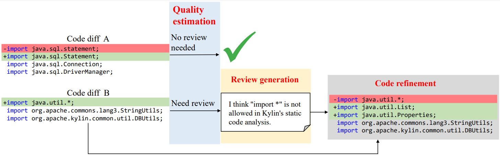
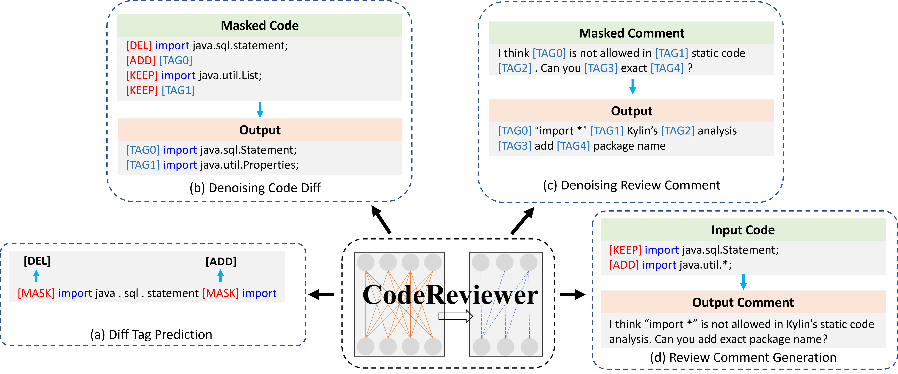

# PreViewer: Pre-trained CodeReviewer

### [WARNING] This repo will not be maintained. Please refer to [CodeReviewer](https://github.com/microsoft/CodeBERT/tree/master/CodeReviewer) for better documentation

We pre-train a CodeReviewer model to automate three code reivew related tasks: **Diff quality estimation**, **Review generation**, **Code refinement**.

Refer to our paper: [CodeReviewer: Pre-Training for Automating Code Review Activities
](https://arxiv.org/abs/2203.09095) for more details.



CodeReviewer is initialized with [CodeT5](https://github.com/salesforce/CodeT5) and further trained on four designed pre-training tasks:



## Training and Evaluation

Scripts are listed in `code/sh` directory.
```bash
# Example:
cd code/sh
bash finetune-cls.sh
```

## Infer a Json file
```bash
cd code/sh
bash infer-json.sh
```

## Data preparation
Collecting GitHub repos: [TopRepos](https://github.com/Lizhmq/TopRepos).

Build pull request database: [ETCR](https://github.com/Lizhmq/etcr-infrastructure).

Build pre-training and benchmark datasets: [CodeReviewProcesser](https://github.com/Lizhmq/CodeReviewProcesser).
